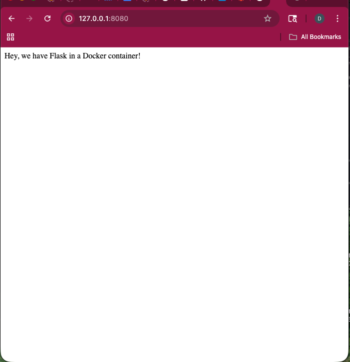

# Flask Docker Homework

Darrell created a simple Flask web app running inside a docker container on a remote server.He  accessed it  locally using  SSH port fowarding

Provided below is a screenshot of the  web application.

